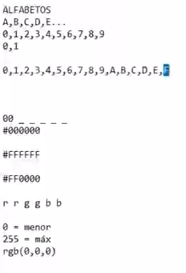

# Definiendo texto

```html
<h1>Sobre la Barbería Alura</h1>
<p>Ubicada en el corazón de la ciudad, la Barbería Alura trae para el mercado lo que hay de mejor para su cabello y barba. Fundada en 2020, la Barbería Alura ya es destaque en la ciudad y conquista nuevos clientes diariamente. </p> 
<p>Nuestra misión es: "Proporcionar autoestima y calidad de vida a nuestros clientes".</p>
<p>Ofrecemos profesionales experimentados que están constantemente observando los cambios y movimiento en el mundo de la moda, para así ofrecer a nuestros clientes las últimas tendencias. El atendimiento posee un padrón de excelencia y agilidad, garantizando calidad y satisfacción de nuestros clientes. </p>
```

# Mejorando el texto

```html
<h1>Sobre la Barbería Alura</h1>
<p>Ubicada en el corazón de la ciudad, la <strong>Barbería Alura</strong> trae para el mercado lo que hay de mejor para su cabello y barba. Fundada en 2020, la Barbería Alura ya es destaque en la ciudad y conquista nuevos clientes diariamente. </p> 
<p><em>Nuestra misión es: <strong>"Proporcionar autoestima y calidad de vida a nuestros clientes"</strong></em>.</p>
<p>Ofrecemos profesionales experimentados que están constantemente observando los cambios y movimiento en el mundo de la moda, para así ofrecer a nuestros clientes las últimas tendencias. El atendimiento posee un padrón de excelencia y agilidad, garantizando calidad y satisfacción de nuestros clientes. </p>
```

# Estructura basica

```html
<!DOCTYPE html>
<html>
<h1>Sobre la Barbería Alura</h1>
<p>Ubicada en el corazón de la ciudad, la <strong>Barbería Alura</strong> trae para el mercado lo que hay de mejor para
    su cabello y barba. Fundada en 2020, la Barbería Alura ya es destaque en la ciudad y conquista nuevos clientes
    diariamente. </p>
<p><em>Nuestra misión es: <strong>"Proporcionar autoestima y calidad de vida a nuestros clientes"</strong></em>.</p>
<p>Ofrecemos profesionales experimentados que están constantemente observando los cambios y movimiento en el mundo de la
    moda, para así ofrecer a nuestros clientes las últimas tendencias. El atendimiento posee un padrón de excelencia y
    agilidad, garantizando calidad y satisfacción de nuestros clientes. </p>
</html>
```

# Pasando datos para el navegador

```html
<!DOCTYPE html>
<html lang="es">
<meta charset="UTF-8">
<title>Barberia Alura</title>
<h1>Sobre la Barbería Alura</h1>
<p>Ubicada en el corazón de la ciudad, la <strong>Barbería Alura</strong> trae para el mercado lo que hay de mejor para
    su cabello y barba. Fundada en 2020, la Barbería Alura ya es destaque en la ciudad y conquista nuevos clientes
    diariamente. </p>
<p><em>Nuestra misión es: <strong>"Proporcionar autoestima y calidad de vida a nuestros clientes"</strong></em>.</p>
<p>Ofrecemos profesionales experimentados que están constantemente observando los cambios y movimiento en el mundo de la
    moda, para así ofrecer a nuestros clientes las últimas tendencias. El atendimiento posee un padrón de excelencia y
    agilidad, garantizando calidad y satisfacción de nuestros clientes. </p>
</html>
```

# Separando contenido e informacion

```html
<!DOCTYPE html>
<html lang="es">

<head>
    <meta charset="UTF-8">
    <title>Barberia Alura</title>
</head>
<body>
    <h1>Sobre la Barbería Alura</h1>
    <p>Ubicada en el corazón de la ciudad, la <strong>Barbería Alura</strong> trae para el mercado lo que hay de mejor
        para
        su cabello y barba. Fundada en 2020, la Barbería Alura ya es destaque en la ciudad y conquista nuevos clientes
        diariamente. </p>
    <p><em>Nuestra misión es: <strong>"Proporcionar autoestima y calidad de vida a nuestros clientes"</strong></em>.</p>
    <p>Ofrecemos profesionales experimentados que están constantemente observando los cambios y movimiento en el mundo
        de la
        moda, para así ofrecer a nuestros clientes las últimas tendencias. El atendimiento posee un padrón de excelencia
        y
        agilidad, garantizando calidad y satisfacción de nuestros clientes. </p>
</body>
</html>
```

# Comenzando con CSS

```html
<!DOCTYPE html>
<html lang="es">

<head>
    <meta charset="UTF-8">
    <title>Barberia Alura</title>
</head>
<body>
    <h1 style="text-align: center;">Sobre la Barbería Alura</h1>
    <p style="text-align: center;"">Ubicada en el corazón de la ciudad, la <strong>Barbería Alura</strong> trae para el mercado lo que hay de mejor
        para
        su cabello y barba. Fundada en 2020, la Barbería Alura ya es destaque en la ciudad y conquista nuevos clientes
        diariamente. </p>
    <p style="font-size: 20px;text-align: center;"><em>Nuestra misión es: <strong>"Proporcionar autoestima y calidad de vida a nuestros clientes"</strong></em>.</p>
    <p style="text-align: center;"">Ofrecemos profesionales experimentados que están constantemente observando los cambios y movimiento en el mundo
        de la
        moda, para así ofrecer a nuestros clientes las últimas tendencias. El atendimiento posee un padrón de excelencia
        y
        agilidad, garantizando calidad y satisfacción de nuestros clientes. </p>
</body>
</html>
```

# Organizando el estilo

```html
<!DOCTYPE html>
<html lang="es">

<head>
    <meta charset="UTF-8">
    <title>Barberia Alura</title>
    <link rel="stylesheet" href="style.css">
</head>

<body>
    <h1 style="text-align: center;">Sobre la Barbería Alura</h1>
    <p>Ubicada en el corazón de la ciudad, la <strong>Barbería Alura</strong> trae para el mercado lo que hay de mejor
        para
        su cabello y barba. Fundada en 2020, la Barbería Alura ya es destaque en la ciudad y conquista nuevos clientes
        diariamente. </p>
    <p style="font-size: 20px;"><em>Nuestra misión es: <strong>"Proporcionar autoestima y calidad de vida a nuestros
                clientes"</strong></em>.</p>
    <p>Ofrecemos profesionales experimentados que están constantemente observando los cambios y movimiento en el mundo
        de la
        moda, para así ofrecer a nuestros clientes las últimas tendencias. El atendimiento posee un padrón de excelencia
        y
        agilidad, garantizando calidad y satisfacción de nuestros clientes. </p>
</body>

</html>
```

```css
p{
    text-align: center;
}
```

# Alterando el color

```html
<!DOCTYPE html>
<html lang="es">

<head>
    <meta charset="UTF-8">
    <title>Barberia Alura</title>
    <link rel="stylesheet" href="style.css">
</head>

<body>
    <h1 style="text-align: center;">Sobre la Barbería Alura</h1>
    <p>Ubicada en el corazón de la ciudad, la <strong>Barbería Alura</strong> trae para el mercado lo que hay de mejor
        para
        su cabello y barba. Fundada en 2020, la Barbería Alura ya es destaque en la ciudad y conquista nuevos clientes
        diariamente. </p>
    <p style="font-size: 20px;"><em>Nuestra misión es: <strong>"Proporcionar autoestima y calidad de vida a nuestros
                clientes"</strong></em>.</p>
    <p>Ofrecemos profesionales experimentados que están constantemente observando los cambios y movimiento en el mundo
        de la
        moda, para así ofrecer a nuestros clientes las últimas tendencias. El atendimiento posee un padrón de excelencia
        y
        agilidad, garantizando calidad y satisfacción de nuestros clientes. </p>
</body>

</html>
```

```css
body {
    background: #CCCCCC;
}

p,
h1 {
    text-align: center;
}

h1 {
    text-align: center;
}

em strong {
    color: red;
}
```

# Extra: Colores hexadecimales



# Identificador de elemento y etiqueta de imagen

```html
<!DOCTYPE html>
<html lang="es">
<head>
    <meta charset="UTF-8">
    <title>Barberia Alura</title>
    <link rel="stylesheet" href="style.css">
</head>
<body>
    
    <h1>Sobre la Barbería Alura</h1>
    <p>Ubicada en el corazón de la ciudad, la <strong>Barbería Alura</strong> trae para el mercado lo que hay de mejor
        para
        su cabello y barba. Fundada en 2020, la Barbería Alura ya es destaque en la ciudad y conquista nuevos clientes
        diariamente. </p>
    <p id="mision"><em>Nuestra misión es: <strong>"Proporcionar autoestima y calidad de vida a nuestros
                clientes"</strong></em>.</p>
    <p>Ofrecemos profesionales experimentados que están constantemente observando los cambios y movimiento en el mundo
        de la
        moda, para así ofrecer a nuestros clientes las últimas tendencias. El atendimiento posee un padrón de excelencia
        y
        agilidad, garantizando calidad y satisfacción de nuestros clientes. </p>
</body>
</html>
```

```css
body {
    background: #CCCCCC;
}
p, h1 {
    text-align: center;
}
em strong {
    color: red;
}
#mision {
    font-size: 20px;
}
```

# CSS para imagenes

```html
<!DOCTYPE html>
<html lang="es">
<head>
    <meta charset="UTF-8">
    <title>Barberia Alura</title>
    <link rel="stylesheet" href="style.css">
</head>
<body>
    
    <h1>Sobre la Barbería Alura</h1>
    <p>Ubicada en el corazón de la ciudad, la <strong>Barbería Alura</strong> trae para el mercado lo que hay de mejor
        para
        su cabello y barba. Fundada en 2020, la Barbería Alura ya es destaque en la ciudad y conquista nuevos clientes
        diariamente. </p>
    <p id="mision"><em>Nuestra misión es: <strong>"Proporcionar autoestima y calidad de vida a nuestros
                clientes"</strong></em>.</p>
    <p>Ofrecemos profesionales experimentados que están constantemente observando los cambios y movimiento en el mundo
        de la
        moda, para así ofrecer a nuestros clientes las últimas tendencias. El atendimiento posee un padrón de excelencia
        y
        agilidad, garantizando calidad y satisfacción de nuestros clientes. </p>
</body>
</html>
```

```css
body {
    background: #CCCCCC;
}
#banner {
    width: 100%;
}

p, h1 {
    text-align: center;
}
em strong {
    color: red;
}
#mision {
    font-size: 20px;
}
```

# Trabajando con listas

```html
<!DOCTYPE html>
<html lang="es">
<head>
    <meta charset="UTF-8">
    <title>Barberia Alura</title>
    <link rel="stylesheet" href="style.css">
</head>
<body>
    
    <h1>Sobre la Barbería Alura</h1>
    <p>Ubicada en el corazón de la ciudad, la <strong>Barbería Alura</strong> trae para el mercado lo que hay de mejor
        para
        su cabello y barba. Fundada en 2020, la Barbería Alura ya es destaque en la ciudad y conquista nuevos clientes
        diariamente. </p>
    <p id="mision"><em>Nuestra misión es: <strong>"Proporcionar autoestima y calidad de vida a nuestros
                clientes"</strong></em>.</p>
    <p>Ofrecemos profesionales experimentados que están constantemente observando los cambios y movimiento en el mundo
        de la
        moda, para así ofrecer a nuestros clientes las últimas tendencias. El atendimiento posee un padrón de excelencia
        y
        agilidad, garantizando calidad y satisfacción de nuestros clientes. </p>

        <h2>Diferenciales</h2>
        <ul>
            <li class="items">Atencion personalizada a los clientes</li>
            <li class="items">Espacio Diferenciado</li>
            <li class="items">Localizacion</li>
            <li class="items">Profesionales Calificados</li>
        </ul>
</body>
</html>
```

```css
body {
    background: #CCCCCC;
}
#banner {
    width: 100%;
}

p, h1 {
    text-align: center;
}
em strong {
    color: red;
}
#mision {
    font-size: 20px;
}
.items {
    font-style: italic;
}
```

# Divisiones de contenido
# Inline y Block

```html
<!DOCTYPE html>
<html lang="es">

<head>
    <meta charset="UTF-8">
    <title>Barberia Alura</title>
    <link rel="stylesheet" href="style.css">
</head>

<body>
    
    <div class="principal">
        <h1>Sobre la Barbería Alura</h1>
        <p>Ubicada en el corazón de la ciudad, la <strong>Barbería Alura</strong> trae para el mercado lo que hay de
            mejor
            para
            su cabello y barba. Fundada en 2020, la Barbería Alura ya es destaque en la ciudad y conquista nuevos
            clientes
            diariamente. </p>
        <p id="mision"><em>Nuestra misión es: <strong>"Proporcionar autoestima y calidad de vida a nuestros
                    clientes"</strong></em>.</p>
        <p>Ofrecemos profesionales experimentados que están constantemente observando los cambios y movimiento en el
            mundo
            de la
            moda, para así ofrecer a nuestros clientes las últimas tendencias. El atendimiento posee un padrón de
            excelencia
            y
            agilidad, garantizando calidad y satisfacción de nuestros clientes. </p>
    </div>
    <div class="diferenciales">
        <h2>Diferenciales</h2>
        <ul>
            <li class="items">Atencion personalizada a los clientes</li>
            <li class="items">Espacio Diferenciado</li>
            <li class="items">Localizacion</li>
            <li class="items">Profesionales Calificados</li>
        </ul>
        
    </div>
</body>
</html>
```

```css
#banner {
    width: 100%;
}
p, h1 {
    text-align: center;
}
em strong {
    color: red;
}
#mision {
    font-size: 20px;
}
.principal{
    background: #ccc;
    padding: 20px;
}
.diferenciales {
    background: #fff;
    padding: 30px;
}
h2 {
    text-align: center;
}
.items {
    font-style: italic;
}
ul {
    display: inline-block;
    vertical-align: top;
    width: 20%;
    margin-right: 15%;
}
.imagenDiferenciales {
    width: 50%;
}
```

# Encabezado

```html
<!DOCTYPE html>
<html lang="es">

<head>
    <meta charset="UTF-8">
    <title>Barberia Alura</title>
    <link rel="stylesheet" href="style.css">
</head>

<body>
    <header>
        <h1 class="titulo-principal">Barberia Alura</h1>
    </header>
    
    <div class="principal">
        <h2 class="titulo-centralizado">Sobre la Barbería Alura</h2>
        <p>Ubicada en el corazón de la ciudad, la <strong>Barbería Alura</strong> trae para el mercado lo que hay de
            mejor
            para
            su cabello y barba. Fundada en 2020, la Barbería Alura ya es destaque en la ciudad y conquista nuevos
            clientes
            diariamente. </p>
        <p id="mision"><em>Nuestra misión es: <strong>"Proporcionar autoestima y calidad de vida a nuestros
                    clientes"</strong></em>.</p>
        <p>Ofrecemos profesionales experimentados que están constantemente observando los cambios y movimiento en el
            mundo
            de la
            moda, para así ofrecer a nuestros clientes las últimas tendencias. El atendimiento posee un padrón de
            excelencia
            y
            agilidad, garantizando calidad y satisfacción de nuestros clientes. </p>
    </div>
    <div class="diferenciales">
        <h3 class="titulo-centralizado">Diferenciales</h3>
        <ul>
            <li class="items">Atencion personalizada a los clientes</li>
            <li class="items">Espacio Diferenciado</li>
            <li class="items">Localizacion</li>
            <li class="items">Profesionales Calificados</li>
        </ul>
        
    </div>
</body>

</html>
```

```css
.titulo-principal {
    padding-left: 30px;
}

#banner {
    width: 100%;
}
p {
    text-align: center;
}
.titulo-centralizado {
    text-align: center;
}
em strong {
    color: red;
}
#mision {
    font-size: 20px;
}
.principal{
    background: #ccc;
    padding: 20px;
}
.diferenciales {
    background: #fff;
    padding: 30px;
}

.items {
    font-style: italic;
}
ul {
    display: inline-block;
    vertical-align: top;
    width: 20%;
    margin-right: 15%;
}
.imagenDiferenciales {
    width: 50%;
}
```