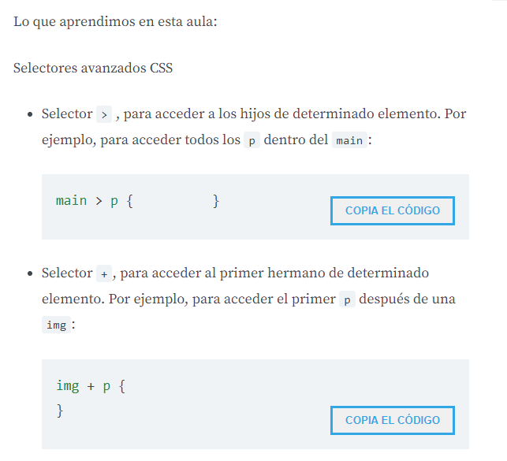
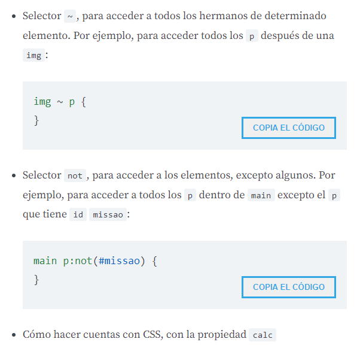

# Presentacion
# Rehaciendo la pagina inicial
# Adaptando el CSS
# Usando el float

```html
<!DOCTYPE html>
<html lang="es">

<head>
    <meta charset="UTF-8">
    <title>Barberia Alura</title>
    <link rel="stylesheet" href="reset.css">
    <link rel="stylesheet" href="style.css">
</head>

<body>
    <header>
        <div class="caja">
            <h1></h1>
            <nav>
                <ul>
                    <li><a href="index.html">Home</a></li>
                    <li><a href="productos.html">Productos</a></li>
                    <li><a href="contacto.html">Contacto</a></li>
                </ul>
            </nav>
        </div>
    </header>
    
    <main>
        <section class="principal">
            <h2 class="titulo-principal">Sobre la Barbería Alura</h2>
            
            <p>Ubicada en el corazón de la ciudad, la <strong>Barbería Alura</strong> trae para el mercado lo que hay de
                mejor
                para
                su cabello y barba. Fundada en 2020, la Barbería Alura ya es destaque en la ciudad y conquista nuevos
                clientes
                diariamente. </p>
            <p id="mision"><em>Nuestra misión es: <strong>"Proporcionar autoestima y calidad de vida a nuestros
                        clientes"</strong></em>.</p>
            <p>Ofrecemos profesionales experimentados que están constantemente observando los cambios y movimiento en el
                mundo
                de la
                moda, para así ofrecer a nuestros clientes las últimas tendencias. El atendimiento posee un padrón de
                excelencia
                y
                agilidad, garantizando calidad y satisfacción de nuestros clientes. </p>
        </section>
        <section class="diferenciales">
            <h3 class="titulo-principal">Diferenciales</h3>
            <ul>
                <li class="items">Atencion personalizada a los clientes</li>
                <li class="items">Espacio Diferenciado</li>
                <li class="items">Localizacion</li>
                <li class="items">Profesionales Calificados</li>
            </ul>
            
        </section>
    </main>

    <footer>
        
        <p class="copyright">&copy Copyriht Barbaria Alura - 2020</p>
    </footer>
</body>

</html>
```

```css
header {
    background: #BBB;
    padding: 20px 0;
}
.caja {
    width: 940px;
    position: relative;
    margin: 0 auto;
}
nav {
    position: absolute;
    top: 115px;
    right: 0px;
}
nav li {
    display: inline;
    margin: 0 0 0 15px;
}
nav a {
    text-transform: uppercase;
    color: #000;
    font-weight: bold;
    font-size: 22px;
    text-decoration: none;
}
nav a:hover{
    color: #c78c19;
    text-decoration: underline;
}

.productos {
    width: 940px;
    margin: 0 auto;
    padding: 50px;
}
.productos li {
    display: inline-block;
    text-align: center;
    width: 30%;
    vertical-align: top;
    margin: 0 1.5%;
    padding: 30px 20px;
    box-sizing: border-box;
    border: 2px solid #000;
    border-radius: 10px;
}
.productos li:hover {
    border-color: #c78c19;

} 
.productos li:active {
    border-color: #088c19;
}
.productos h2 {
    font-size: 30px;
    font-weight: bold;
}
.productos li:hover h2{
    font-size: 33px;
}
.producto-descripcion {
    font-size: 18px;
}
.producto-precio {
    font-size: 20px;
    font-weight: bold;
    margin-top: 10px;
}
footer {
    text-align: center;
    background: url(bg.jpg);   
    padding: 40px;
}
.copyright {
    color: #fff;
    font-size: 13px;
    margin: 20px;
}
main {
    width: 940px;
    margin: 0 auto;
}
form {
    margin: 40px 0;
}
form label, form legend {
    display: block;
    font-size: 20px;
    margin: 0 0 10px;
}
.input-padron {
    display: block;
    padding: 10px 25px;
    width: 50%;
    margin: 0 0 20px 0;
}
.checkbox {
    margin: 20px 0;
}
.enviar {
    width: 40%;
    padding: 15px 0;
    font-size: 18px;
    font-weight: bold;
    color: white;
    background: orange;
    border: none;
    border-radius: 5px;
    transition: 1s all;
    cursor: pointer;
}
.enviar:hover {
    background: darkorange;
    transform: scale(1.1);
}
table {
    margin: 40px;
}
thead {
    background: #555;
    color: white;
    font-weight: bold;
}
td,th {
    border: 1px solid #000;
    padding: 8px 15px;
}

/*CSS para nuestra home*/

.banner {
    width: 100%;
}
.titulo-principal {
    text-align: center;
    font-size: 2em;
    margin: 0 0 1em;
    clear: left;
}
.principal p {
    margin: 0 0 1em;
}
.principal strong {
    font-weight: bold;
}
.principal em {
    font-style: italic;
}
.utensilios {
    width: 120px;
    float: left;
    margin:  0 20px 20px 0;
}
.imagenDiferenciales {
    width: 60%;
}
```

# Fuentes externas
# Trabajando con mapas
# Importando un video

```html
<!DOCTYPE html>
<html lang="es">
<head>
    <meta charset="UTF-8">
    <title>Barberia Alura</title>
    <link rel="stylesheet" href="reset.css">
    <link rel="stylesheet" href="style.css">
    <link rel="preconnect" href="https://fonts.googleapis.com">
    <link rel="preconnect" href="https://fonts.gstatic.com" crossorigin>
    <link href="https://fonts.googleapis.com/css2?family=Montserrat:wght@300&display=swap" rel="stylesheet">
</head>
<body>
    <header>
        <div class="caja">
            <h1></h1>
            <nav>
                <ul>
                    <li><a href="index.html">Home</a></li>
                    <li><a href="productos.html">Productos</a></li>
                    <li><a href="contacto.html">Contacto</a></li>
                </ul>
            </nav>
        </div>
    </header>
    
    <main>
        <section class="principal">
            <h2 class="titulo-principal">Sobre la Barbería Alura</h2>
            
            <p>Ubicada en el corazón de la ciudad, la <strong>Barbería Alura</strong> trae para el mercado lo que hay de
                mejor
                para
                su cabello y barba. Fundada en 2020, la Barbería Alura ya es destaque en la ciudad y conquista nuevos
                clientes
                diariamente. </p>
            <p id="mision"><em>Nuestra misión es: <strong>"Proporcionar autoestima y calidad de vida a nuestros
                        clientes"</strong></em>.</p>
            <p>Ofrecemos profesionales experimentados que están constantemente observando los cambios y movimiento en el
                mundo
                de la
                moda, para así ofrecer a nuestros clientes las últimas tendencias. El atendimiento posee un padrón de
                excelencia
                y
                agilidad, garantizando calidad y satisfacción de nuestros clientes. </p>
        </section>
        <section class="mapa">
            <h3 class="titulo-principal">Nuestra ubicacion</h3>
            <p>Nuestro establecimiento esta ubicado en el corazon de la ciudad</p>
            <iframe src="https://www.google.com/maps/embed?pb=!1m18!1m12!1m3!1d62450.074505064265!2d-77.11509377592428!3d-11.965523915609127!2m3!1f0!2f0!3f0!3m2!1i1024!2i768!4f13.1!3m3!1m2!1s0x9105ce21b6748c45%3A0xece5fa25a5e8c4d5!2sLos%20Olivos!5e0!3m2!1ses!2spe!4v1682665290682!5m2!1ses!2spe" width="100%" height="300" style="border:0;" allowfullscreen="" loading="lazy" referrerpolicy="no-referrer-when-downgrade">
            </iframe>
        </section>
        <section class="diferenciales">
            <h3 class="titulo-principal">Diferenciales</h3>
            <ul>
                <li class="items">Atencion personalizada a los clientes</li>
                <li class="items">Espacio Diferenciado</li>
                <li class="items">Localizacion</li>
                <li class="items">Profesionales Calificados</li>
            </ul>
            
            <div class="video">
                <iframe width="560" height="315" src="https://www.youtube.com/embed/-FqVUUXnjG0" title="YouTube video player" frameborder="0" allow="accelerometer; autoplay; clipboard-write; encrypted-media; gyroscope; picture-in-picture; web-share" allowfullscreen></iframe>
            </div>
        </section>
    </main>
    <footer>
        
        <p class="copyright">&copy Copyriht Barbaria Alura - 2020</p>
    </footer>
</body>
</html>
```

```css
body {
    font-family: 'Montserrat', sans-serif;
}
header {
    background: #BBB;
    padding: 20px 0;
}
.caja {
    width: 940px;
    position: relative;
    margin: 0 auto;
}
nav {
    position: absolute;
    top: 115px;
    right: 0px;
}
nav li {
    display: inline;
    margin: 0 0 0 15px;
}
nav a {
    text-transform: uppercase;
    color: #000;
    font-weight: bold;
    font-size: 22px;
    text-decoration: none;
}
nav a:hover{
    color: #c78c19;
    text-decoration: underline;
}

.productos {
    width: 940px;
    margin: 0 auto;
    padding: 50px;
}
.productos li {
    display: inline-block;
    text-align: center;
    width: 30%;
    vertical-align: top;
    margin: 0 1.5%;
    padding: 30px 20px;
    box-sizing: border-box;
    border: 2px solid #000;
    border-radius: 10px;
}
.productos li:hover {
    border-color: #c78c19;

} 
.productos li:active {
    border-color: #088c19;
}
.productos h2 {
    font-size: 30px;
    font-weight: bold;
}
.productos li:hover h2{
    font-size: 33px;
}
.producto-descripcion {
    font-size: 18px;
}
.producto-precio {
    font-size: 20px;
    font-weight: bold;
    margin-top: 10px;
}
footer {
    text-align: center;
    background: url(bg.jpg);   
    padding: 40px;
}
.copyright {
    color: #fff;
    font-size: 13px;
    margin: 20px;
}
main {
    width: 940px;
    margin: 0 auto;
}
form {
    margin: 40px 0;
}
form label, form legend {
    display: block;
    font-size: 20px;
    margin: 0 0 10px;
}
.input-padron {
    display: block;
    padding: 10px 25px;
    width: 50%;
    margin: 0 0 20px 0;
}
.checkbox {
    margin: 20px 0;
}
.enviar {
    width: 40%;
    padding: 15px 0;
    font-size: 18px;
    font-weight: bold;
    color: white;
    background: orange;
    border: none;
    border-radius: 5px;
    transition: 1s all;
    cursor: pointer;
}
.enviar:hover {
    background: darkorange;
    transform: scale(1.1);
}
table {
    margin: 40px;
}
thead {
    background: #555;
    color: white;
    font-weight: bold;
}
td,th {
    border: 1px solid #000;
    padding: 8px 15px;
}

/*CSS para nuestra home*/

.banner {
    width: 100%;
}
.titulo-principal {
    text-align: center;
    font-size: 2em;
    margin: 0 0 1em;
    clear: left;
}
.principal p {
    margin: 0 0 1em;
}
.principal strong {
    font-weight: bold;
}
.principal em {
    font-style: italic;
}
.utensilios {
    width: 120px;
    float: left;
    margin:  0 20px 20px 0;
}
.mapa {
    padding: 3em 0;
}
.mapa p {
    margin: 0 0 2em;
    text-align: center;
}
.imagenDiferenciales {
    width: 60%;
}
.video {
    width: 560px;
    margin: 1em auto;
}
```

# Ajustando los diferenciales
# Pesudo-classes
# Aplicando gradientes
# Pseudo-elementos

```html
<!DOCTYPE html>
<html lang="es">

<head>
    <meta charset="UTF-8">
    <title>Barberia Alura</title>
    <link rel="stylesheet" href="reset.css">
    <link rel="stylesheet" href="style.css">
    <link rel="preconnect" href="https://fonts.googleapis.com">
    <link rel="preconnect" href="https://fonts.gstatic.com" crossorigin>
    <link href="https://fonts.googleapis.com/css2?family=Montserrat:wght@300&display=swap" rel="stylesheet">
</head>

<body>
    <header>
        <div class="caja">
            <h1></h1>
            <nav>
                <ul>
                    <li><a href="index.html">Home</a></li>
                    <li><a href="productos.html">Productos</a></li>
                    <li><a href="contacto.html">Contacto</a></li>
                </ul>
            </nav>
        </div>
    </header>
    
    <main>
        <section class="principal">
            <h2 class="titulo-principal">Sobre la Barbería Alura</h2>
            
            <p>Ubicada en el corazón de la ciudad, la <strong>Barbería Alura</strong> trae para el mercado lo que hay de
                mejor
                para
                su cabello y barba. Fundada en 2020, la Barbería Alura ya es destaque en la ciudad y conquista nuevos
                clientes
                diariamente. </p>
            <p id="mision"><em>Nuestra misión es: <strong>"Proporcionar autoestima y calidad de vida a nuestros
                        clientes"</strong></em>.</p>
            <p>Ofrecemos profesionales experimentados que están constantemente observando los cambios y movimiento en el
                mundo
                de la
                moda, para así ofrecer a nuestros clientes las últimas tendencias. El atendimiento posee un padrón de
                excelencia
                y
                agilidad, garantizando calidad y satisfacción de nuestros clientes. </p>
        </section>
        <section class="mapa">
            <h3 class="titulo-principal">Nuestra ubicacion</h3>
            <p>Nuestro establecimiento esta ubicado en el corazon de la ciudad</p>
            <div class="mapa-contenido">
                <iframe
                src="https://www.google.com/maps/embed?pb=!1m18!1m12!1m3!1d62450.074505064265!2d-77.11509377592428!3d-11.965523915609127!2m3!1f0!2f0!3f0!3m2!1i1024!2i768!4f13.1!3m3!1m2!1s0x9105ce21b6748c45%3A0xece5fa25a5e8c4d5!2sLos%20Olivos!5e0!3m2!1ses!2spe!4v1682665290682!5m2!1ses!2spe"
                width="100%" height="300" style="border:0;" allowfullscreen="" loading="lazy"
                referrerpolicy="no-referrer-when-downgrade">
            </iframe>
            </div>
            
        </section>
        <section class="diferenciales">
            <h3 class="titulo-principal">Diferenciales</h3>
            <div class="contenido-diferenciales">
                <ul class="lista-diferenciales">
                    <li class="items">Atencion personalizada a los clientes</li>
                    <li class="items">Espacio Diferenciado</li>
                    <li class="items">Localizacion</li>
                    <li class="items">Profesionales Calificados</li>
                    <li class="items">Puntualidad</li>
                    <li class="items">Limpieza</li>
                </ul>
            </div>
            <div class="video">
                <iframe width="560" height="315" src="https://www.youtube.com/embed/-FqVUUXnjG0"
                    title="YouTube video player" frameborder="0"
                    allow="accelerometer; autoplay; clipboard-write; encrypted-media; gyroscope; picture-in-picture; web-share"
                    allowfullscreen></iframe>
            </div>
        </section>       
    </main>
    <footer>
        
        <p class="copyright">&copy Copyriht Barbaria Alura - 2020</p>
    </footer>
</body>
</html>
```

```css
body {
    font-family: 'Montserrat', sans-serif;
}
header {
    background: #BBB;
    padding: 20px 0;
}
.caja {
    width: 940px;
    position: relative;
    margin: 0 auto;
}
nav {
    position: absolute;
    top: 115px;
    right: 0px;
}
nav li {
    display: inline;
    margin: 0 0 0 15px;
}
nav a {
    text-transform: uppercase;
    color: #000;
    font-weight: bold;
    font-size: 22px;
    text-decoration: none;
}
nav a:hover{
    color: #c78c19;
    text-decoration: underline;
}

.productos {
    width: 940px;
    margin: 0 auto;
    padding: 50px;
}
.productos li {
    display: inline-block;
    text-align: center;
    width: 30%;
    vertical-align: top;
    margin: 0 1.5%;
    padding: 30px 20px;
    box-sizing: border-box;
    border: 2px solid #000;
    border-radius: 10px;
}
.productos li:hover {
    border-color: #c78c19;

} 
.productos li:active {
    border-color: #088c19;
}
.productos h2 {
    font-size: 30px;
    font-weight: bold;
}
.productos li:hover h2{
    font-size: 33px;
}
.producto-descripcion {
    font-size: 18px;
}
.producto-precio {
    font-size: 20px;
    font-weight: bold;
    margin-top: 10px;
}
footer {
    text-align: center;
    background: url(bg.jpg);   
    padding: 40px;
}
.copyright {
    color: #fff;
    font-size: 13px;
    margin: 20px;
}
form {
    margin: 40px 0;
}
form label, form legend {
    display: block;
    font-size: 20px;
    margin: 0 0 10px;
}
.input-padron {
    display: block;
    padding: 10px 25px;
    width: 50%;
    margin: 0 0 20px 0;
}
.checkbox {
    margin: 20px 0;
}
.enviar {
    width: 40%;
    padding: 15px 0;
    font-size: 18px;
    font-weight: bold;
    color: white;
    background: orange;
    border: none;
    border-radius: 5px;
    transition: 1s all;
    cursor: pointer;
}
.enviar:hover {
    background: darkorange;
    transform: scale(1.1);
}
table {
    margin: 40px;
}
thead {
    background: #555;
    color: white;
    font-weight: bold;
}
td,th {
    border: 1px solid #000;
    padding: 8px 15px;
}

/*CSS para nuestra home*/

.banner {
    width: 100%;
}
.principal {
    padding: 3em 0;
    background: #FEFEFE;
    width: 940px;
    margin: 0 auto;
}
.titulo-principal {
    text-align: center;
    font-size: 2em;
    margin: 0 0 1em;
    clear: left;
}
.principal p {
    margin: 0 0 1em;
}
.principal strong {
    font-weight: bold;
}
.principal em {
    font-style: italic;
}
.utensilios {
    width: 120px;
    float: left;
    margin:  0 20px 20px 0;
}
.mapa {
    padding: 3em 0;
    background: linear-gradient(#FEFEFE, #888);
}
.mapa p {
    margin: 0 0 2em;
    text-align: center;
}
.mapa-contenido {
    width: 940px;
    margin: 0 auto;
}
.diferenciales {
    padding: 3em 0;
    background: #888;
}
.contenido-diferenciales {
    width: 640px;
    margin: 0 auto;
}
.lista-diferenciales {
    width: 40%;
    display: inline-block;
    vertical-align: top;
}
.items {
    line-height: 1.5;
}
.items:first-child {
    font-weight: bold;
}
.items::before{
    content: "🌟";
}
.imagen-diferenciales {
    width: 60%;
}
.video {
    width: 560px;
    margin: 1em auto;
}
```

# Selectores avanzados
# Calculo con CSS

```html
<!DOCTYPE html>
<html lang="es">

<head>
    <meta charset="UTF-8">
    <title>Barberia Alura</title>
    <link rel="stylesheet" href="reset.css">
    <link rel="stylesheet" href="style.css">
    <link rel="preconnect" href="https://fonts.googleapis.com">
    <link rel="preconnect" href="https://fonts.gstatic.com" crossorigin>
    <link href="https://fonts.googleapis.com/css2?family=Montserrat:wght@300&display=swap" rel="stylesheet">
</head>

<body>
    <header>
        <div class="caja">
            <h1></h1>
            <nav>
                <ul>
                    <li><a href="index.html">Home</a></li>
                    <li><a href="productos.html">Productos</a></li>
                    <li><a href="contacto.html">Contacto</a></li>
                </ul>
            </nav>
        </div>
    </header>
    
    <main>
        <section class="principal">
            <h2 class="titulo-principal">Sobre la Barbería Alura</h2>
            
            <p>Ubicada en el corazón de la ciudad, la <strong>Barbería Alura</strong> trae para el mercado lo que hay de
                mejor
                para
                su cabello y barba. Fundada en 2020, la Barbería Alura ya es destaque en la ciudad y conquista nuevos
                clientes
                diariamente. </p>
            <p id="mision"><em>Nuestra misión es: <strong>"Proporcionar autoestima y calidad de vida a nuestros
                        clientes"</strong></em>.</p>
            <p>Ofrecemos profesionales experimentados que están constantemente observando los cambios y movimiento en el
                mundo
                de la
                moda, para así ofrecer a nuestros clientes las últimas tendencias. El atendimiento posee un padrón de
                excelencia
                y
                agilidad, garantizando calidad y satisfacción de nuestros clientes. </p>
        </section>
        <section class="mapa">
            <h3 class="titulo-principal">Nuestra ubicacion</h3>
            <p>Nuestro establecimiento esta ubicado en el corazon de la ciudad</p>
            <div class="mapa-contenido">
                <iframe
                src="https://www.google.com/maps/embed?pb=!1m18!1m12!1m3!1d62450.074505064265!2d-77.11509377592428!3d-11.965523915609127!2m3!1f0!2f0!3f0!3m2!1i1024!2i768!4f13.1!3m3!1m2!1s0x9105ce21b6748c45%3A0xece5fa25a5e8c4d5!2sLos%20Olivos!5e0!3m2!1ses!2spe!4v1682665290682!5m2!1ses!2spe"
                width="100%" height="300" style="border:0;" allowfullscreen="" loading="lazy"
                referrerpolicy="no-referrer-when-downgrade">
            </iframe>
            </div>
            
        </section>
        <section class="diferenciales">
            <h3 class="titulo-principal">Diferenciales</h3>
            <div class="contenido-diferenciales">
                <ul class="lista-diferenciales">
                    <li class="items">Atencion personalizada a los clientes</li>
                    <li class="items">Espacio Diferenciado</li>
                    <li class="items">Localizacion</li>
                    <li class="items">Profesionales Calificados</li>
                    <li class="items">Puntualidad</li>
                    <li class="items">Limpieza</li>
                </ul>
            </div>
            <div class="video">
                <iframe width="560" height="315" src="https://www.youtube.com/embed/-FqVUUXnjG0"
                    title="YouTube video player" frameborder="0"
                    allow="accelerometer; autoplay; clipboard-write; encrypted-media; gyroscope; picture-in-picture; web-share"
                    allowfullscreen></iframe>
            </div>
        </section>       
    </main>
    <footer>
        
        <p class="copyright">&copy Copyriht Barbaria Alura - 2020</p>
    </footer>
</body>
</html>
```

```css
body {
    font-family: 'Montserrat', sans-serif;
}
header {
    background: #BBB;
    padding: 20px 0;
}
.caja {
    width: 940px;
    position: relative;
    margin: 0 auto;
}
nav {
    position: absolute;
    top: 115px;
    right: 0px;
}
nav li {
    display: inline;
    margin: 0 0 0 15px;
}
nav a {
    text-transform: uppercase;
    color: #000;
    font-weight: bold;
    font-size: 22px;
    text-decoration: none;
}
nav a:hover{
    color: #c78c19;
    text-decoration: underline;
}

.productos {
    width: 940px;
    margin: 0 auto;
    padding: 50px;
}
.productos li {
    display: inline-block;
    text-align: center;
    width: 30%;
    vertical-align: top;
    margin: 0 1.5%;
    padding: 30px 20px;
    box-sizing: border-box;
    border: 2px solid #000;
    border-radius: 10px;
}
.productos li:hover {
    border-color: #c78c19;

} 
.productos li:active {
    border-color: #088c19;
}
.productos h2 {
    font-size: 30px;
    font-weight: bold;
}
.productos li:hover h2{
    font-size: 33px;
}
.producto-descripcion {
    font-size: 18px;
}
.producto-precio {
    font-size: 20px;
    font-weight: bold;
    margin-top: 10px;
}
footer {
    text-align: center;
    background: url(bg.jpg);   
    padding: 40px;
}
.copyright {
    color: #fff;
    font-size: 13px;
    margin: 20px;
}
form {
    margin: 40px 0;
}
form label, form legend {
    display: block;
    font-size: 20px;
    margin: 0 0 10px;
}
.input-padron {
    display: block;
    padding: 10px 25px;
    width: 50%;
    margin: 0 0 20px 0;
}
.checkbox {
    margin: 20px 0;
}
.enviar {
    width: 40%;
    padding: 15px 0;
    font-size: 18px;
    font-weight: bold;
    color: white;
    background: orange;
    border: none;
    border-radius: 5px;
    transition: 1s all;
    cursor: pointer;
}
.enviar:hover {
    background: darkorange;
    transform: scale(1.1);
}
table {
    margin: 40px;
}
thead {
    background: #555;
    color: white;
    font-weight: bold;
}
td,th {
    border: 1px solid #000;
    padding: 8px 15px;
}

/*CSS para nuestra home*/

.banner {
    width: 100%;
}
/*
main > p {      Selector avanzado donde se aplica estilos a los parrafos hijos directos del main
    background: red;
}
img + p {       Con esto selecciono al primer parrafo que esta despues de la imagen
    background: yellow;

}
img ~ p {       Se selecciona todos los parrafos despues de la iamgen
    background: green;
}
.principal p:not(#mision){      Se selecciona todo menos el que tiene id mision
    background: orange;
}
*/
.principal {
    padding: 3em 0;
    background: #FEFEFE;
    width: 940px;
    margin: 0 auto;
}
.titulo-principal {
    text-align: center;
    font-size: 2em;
    margin: 0 0 1em;
    clear: left;
}
.principal p {
    margin: 0 0 1em;
}
.principal strong {
    font-weight: bold;
}
.principal em {
    font-style: italic;
}
.utensilios {
    width: 120px;
    float: left;
    margin:  0 20px 20px 0;
}
.mapa {
    padding: 3em 0;
    background: linear-gradient(#FEFEFE, #888);
}
.mapa p {
    margin: 0 0 2em;
    text-align: center;
}
.mapa-contenido {
    width: 940px;
    margin: 0 auto;
}
.diferenciales {
    padding: 3em 0;
    background: #888;
}
.contenido-diferenciales {
    width: 640px;
    margin: 0 auto;
}
.lista-diferenciales {
    width: 40%;
    display: inline-block;
    vertical-align: top;
}
.items {
    line-height: 1.5;
}
.items:first-child {
    font-weight: bold;
}
.items::before{
    content: "🌟";
}
.imagen-diferenciales {
    width: 60%;
}
.video {
    width: 560px;
    margin: 1em auto;
}
```





# Opacidad en los elementos
# Sombra interna en un elemento

```html
<!DOCTYPE html>
<html lang="es">

<head>
    <meta charset="UTF-8">
    <title>Barberia Alura</title>
    <link rel="stylesheet" href="reset.css">
    <link rel="stylesheet" href="style.css">
    <link rel="preconnect" href="https://fonts.googleapis.com">
    <link rel="preconnect" href="https://fonts.gstatic.com" crossorigin>
    <link href="https://fonts.googleapis.com/css2?family=Montserrat:wght@300&display=swap" rel="stylesheet">
</head>

<body>
    <header>
        <div class="caja">
            <h1></h1>
            <nav>
                <ul>
                    <li><a href="index.html">Home</a></li>
                    <li><a href="productos.html">Productos</a></li>
                    <li><a href="contacto.html">Contacto</a></li>
                </ul>
            </nav>
        </div>
    </header>
    
    <main>
        <section class="principal">
            <h2 class="titulo-principal">Sobre la Barbería Alura</h2>
            
            <p>Ubicada en el corazón de la ciudad, la <strong>Barbería Alura</strong> trae para el mercado lo que hay de
                mejor
                para
                su cabello y barba. Fundada en 2020, la Barbería Alura ya es destaque en la ciudad y conquista nuevos
                clientes
                diariamente. </p>
            <p id="mision"><em>Nuestra misión es: <strong>"Proporcionar autoestima y calidad de vida a nuestros
                        clientes"</strong></em>.</p>
            <p>Ofrecemos profesionales experimentados que están constantemente observando los cambios y movimiento en el
                mundo
                de la
                moda, para así ofrecer a nuestros clientes las últimas tendencias. El atendimiento posee un padrón de
                excelencia
                y
                agilidad, garantizando calidad y satisfacción de nuestros clientes. </p>
        </section>
        <section class="mapa">
            <h3 class="titulo-principal">Nuestra ubicacion</h3>
            <p>Nuestro establecimiento esta ubicado en el corazon de la ciudad</p>
            <div class="mapa-contenido">
                <iframe
                src="https://www.google.com/maps/embed?pb=!1m18!1m12!1m3!1d62450.074505064265!2d-77.11509377592428!3d-11.965523915609127!2m3!1f0!2f0!3f0!3m2!1i1024!2i768!4f13.1!3m3!1m2!1s0x9105ce21b6748c45%3A0xece5fa25a5e8c4d5!2sLos%20Olivos!5e0!3m2!1ses!2spe!4v1682665290682!5m2!1ses!2spe"
                width="100%" height="300" style="border:0;" allowfullscreen="" loading="lazy"
                referrerpolicy="no-referrer-when-downgrade">
            </iframe>
            </div>
            
        </section>
        <section class="diferenciales">
            <h3 class="titulo-principal">Diferenciales</h3>
            <div class="contenido-diferenciales">
                <ul class="lista-diferenciales">
                    <li class="items">Atencion personalizada a los clientes</li>
                    <li class="items">Espacio Diferenciado</li>
                    <li class="items">Localizacion</li>
                    <li class="items">Profesionales Calificados</li>
                    <li class="items">Puntualidad</li>
                    <li class="items">Limpieza</li>
                </ul>
            </div>
            <div class="video">
                <iframe width="560" height="315" src="https://www.youtube.com/embed/-FqVUUXnjG0"
                    title="YouTube video player" frameborder="0"
                    allow="accelerometer; autoplay; clipboard-write; encrypted-media; gyroscope; picture-in-picture; web-share"
                    allowfullscreen></iframe>
            </div>
        </section>       
    </main>
    <footer>
        
        <p class="copyright">&copy Copyriht Barbaria Alura - 2020</p>
    </footer>
</body>
</html>
```

```css
body {
    font-family: 'Montserrat', sans-serif;
}
header {
    background: #BBB;
    padding: 20px 0;
}
.caja {
    width: 940px;
    position: relative;
    margin: 0 auto;
}
nav {
    position: absolute;
    top: 115px;
    right: 0px;
}
nav li {
    display: inline;
    margin: 0 0 0 15px;
}
nav a {
    text-transform: uppercase;
    color: #000;
    font-weight: bold;
    font-size: 22px;
    text-decoration: none;
}
nav a:hover{
    color: #c78c19;
    text-decoration: underline;
}

.productos {
    width: 940px;
    margin: 0 auto;
    padding: 50px;
}
.productos li {
    display: inline-block;
    text-align: center;
    width: 30%;
    vertical-align: top;
    margin: 0 1.5%;
    padding: 30px 20px;
    box-sizing: border-box;
    border: 2px solid #000;
    border-radius: 10px;
}
.productos li:hover {
    border-color: #c78c19;

} 
.productos li:active {
    border-color: #088c19;
}
.productos h2 {
    font-size: 30px;
    font-weight: bold;
}
.productos li:hover h2{
    font-size: 33px;
}
.producto-descripcion {
    font-size: 18px;
}
.producto-precio {
    font-size: 20px;
    font-weight: bold;
    margin-top: 10px;
}
footer {
    text-align: center;
    background: url(bg.jpg);   
    padding: 40px;
}
.copyright {
    color: #fff;
    font-size: 13px;
    margin: 20px;
}
form {
    margin: 40px 0;
}
form label, form legend {
    display: block;
    font-size: 20px;
    margin: 0 0 10px;
}
.input-padron {
    display: block;
    padding: 10px 25px;
    width: 50%;
    margin: 0 0 20px 0;
}
.checkbox {
    margin: 20px 0;
}
.enviar {
    width: 40%;
    padding: 15px 0;
    font-size: 18px;
    font-weight: bold;
    color: white;
    background: orange;
    border: none;
    border-radius: 5px;
    transition: 1s all;
    cursor: pointer;
}
.enviar:hover {
    background: darkorange;
    transform: scale(1.1);
}
table {
    margin: 40px;
}
thead {
    background: #555;
    color: white;
    font-weight: bold;
}
td,th {
    border: 1px solid #000;
    padding: 8px 15px;
}

/*CSS para nuestra home*/

.banner {
    width: 100%;
}
/*
main > p {      Selector avanzado donde se aplica estilos a los parrafos hijos directos del main
    background: red;
}
img + p {       Con esto selecciono al primer parrafo que esta despues de la imagen
    background: yellow;

}
img ~ p {       Se selecciona todos los parrafos despues de la iamgen
    background: green;
}
.principal p:not(#mision){      Se selecciona todo menos el que tiene id mision
    background: orange;
}
*/
.principal {
    padding: 3em 0;
    background: #FEFEFE;
    width: 940px;
    margin: 0 auto;
}
.titulo-principal {
    text-align: center;
    font-size: 2em;
    margin: 0 0 1em;
    clear: left;
    /*color: rgba(218, 0, 0, 0.3);*/
    /*text-shadow: 2px 2px 10px red;*/
}
.principal p {
    margin: 0 0 1em;
}
.principal strong {
    font-weight: bold;
}
.principal em {
    font-style: italic;
}
.utensilios {
    width: 120px;
    float: left;
    margin:  0 20px 20px 0;
}
.mapa {
    padding: 3em 0;
    background: linear-gradient(#FEFEFE, #888);
}
.mapa p {
    margin: 0 0 2em;
    text-align: center;
}
.mapa-contenido {
    width: 940px;
    margin: 0 auto;
}
.diferenciales {
    padding: 3em 0;
    background: #888;
    /*box-shadow: inset 0 0 30px red;*/
}
.contenido-diferenciales {
    width: 640px;
    margin: 0 auto;
}
.lista-diferenciales {
    width: 40%;
    display: inline-block;
    vertical-align: top;
}
.items {
    line-height: 1.5;
}
.items:first-child {
    font-weight: bold;
}
.items::before{
    content: "🌟";
}
.imagen-diferenciales {
    width: 60%;
    transition: 400ms;
    box-shadow: 10px 10px 30px 15px #000;
}
.imagen-diferenciales:hover{
    opacity: 0.3;
}
.video {
    width: 560px;
    margin: 1em auto;
}
```

# Meta tag de Viewport
# Adaptar una pagina para celular
# Conclusion

```html
<!DOCTYPE html>
<html lang="es">

<head>
    <meta charset="UTF-8">
    <meta name="viewport" content="width=device-width">
    <title>Barberia Alura</title>
    <link rel="stylesheet" href="reset.css">
    <link rel="stylesheet" href="style.css">
    <link rel="preconnect" href="https://fonts.googleapis.com">
    <link rel="preconnect" href="https://fonts.gstatic.com" crossorigin>
    <link href="https://fonts.googleapis.com/css2?family=Montserrat:wght@300&display=swap" rel="stylesheet">
</head>

<body>
    <header>
        <div class="caja">
            <h1></h1>
            <nav>
                <ul>
                    <li><a href="index.html">Home</a></li>
                    <li><a href="productos.html">Productos</a></li>
                    <li><a href="contacto.html">Contacto</a></li>
                </ul>
            </nav>
        </div>
    </header>
    
    <main>
        <section class="principal">
            <h2 class="titulo-principal">Sobre la Barbería Alura</h2>
            
            <p>Ubicada en el corazón de la ciudad, la <strong>Barbería Alura</strong> trae para el mercado lo que hay de
                mejor
                para
                su cabello y barba. Fundada en 2020, la Barbería Alura ya es destaque en la ciudad y conquista nuevos
                clientes
                diariamente. </p>
            <p id="mision"><em>Nuestra misión es: <strong>"Proporcionar autoestima y calidad de vida a nuestros
                        clientes"</strong></em>.</p>
            <p>Ofrecemos profesionales experimentados que están constantemente observando los cambios y movimiento en el
                mundo
                de la
                moda, para así ofrecer a nuestros clientes las últimas tendencias. El atendimiento posee un padrón de
                excelencia
                y
                agilidad, garantizando calidad y satisfacción de nuestros clientes. </p>
        </section>
        <section class="mapa">
            <h3 class="titulo-principal">Nuestra ubicacion</h3>
            <p>Nuestro establecimiento esta ubicado en el corazon de la ciudad</p>
            <div class="mapa-contenido">
                <iframe
                src="https://www.google.com/maps/embed?pb=!1m18!1m12!1m3!1d62450.074505064265!2d-77.11509377592428!3d-11.965523915609127!2m3!1f0!2f0!3f0!3m2!1i1024!2i768!4f13.1!3m3!1m2!1s0x9105ce21b6748c45%3A0xece5fa25a5e8c4d5!2sLos%20Olivos!5e0!3m2!1ses!2spe!4v1682665290682!5m2!1ses!2spe"
                width="100%" height="300" style="border:0;" allowfullscreen="" loading="lazy"
                referrerpolicy="no-referrer-when-downgrade">
            </iframe>
            </div>
            
        </section>
        <section class="diferenciales">
            <h3 class="titulo-principal">Diferenciales</h3>
            <div class="contenido-diferenciales">
                <ul class="lista-diferenciales">
                    <li class="items">Atencion personalizada a los clientes</li>
                    <li class="items">Espacio Diferenciado</li>
                    <li class="items">Localizacion</li>
                    <li class="items">Profesionales Calificados</li>
                    <li class="items">Puntualidad</li>
                    <li class="items">Limpieza</li>
                </ul>
            </div>
            <div class="video">
                <iframe width="100%" height="315" src="https://www.youtube.com/embed/-FqVUUXnjG0"
                    title="YouTube video player" frameborder="0"
                    allow="accelerometer; autoplay; clipboard-write; encrypted-media; gyroscope; picture-in-picture; web-share"
                    allowfullscreen></iframe>
            </div>
        </section>       
    </main>
    <footer>
        
        <p class="copyright">&copy Copyriht Barbaria Alura - 2020</p>
    </footer>
</body>
</html>
```

```css
body {
    font-family: 'Montserrat', sans-serif;
}

header {
    background: #BBB;
    padding: 20px 0;
}

.caja {
    width: 940px;
    position: relative;
    margin: 0 auto;
}

nav {
    position: absolute;
    top: 115px;
    right: 0px;
}

nav li {
    display: inline;
    margin: 0 0 0 15px;
}

nav a {
    text-transform: uppercase;
    color: #000;
    font-weight: bold;
    font-size: 22px;
    text-decoration: none;
}

nav a:hover {
    color: #c78c19;
    text-decoration: underline;
}

.productos {
    width: 940px;
    margin: 0 auto;
    padding: 50px;
}

.productos li {
    display: inline-block;
    text-align: center;
    width: 30%;
    vertical-align: top;
    margin: 0 1.5%;
    padding: 30px 20px;
    box-sizing: border-box;
    border: 2px solid #000;
    border-radius: 10px;
}

.productos li:hover {
    border-color: #c78c19;

}

.productos li:active {
    border-color: #088c19;
}

.productos h2 {
    font-size: 30px;
    font-weight: bold;
}

.productos li:hover h2 {
    font-size: 33px;
}

.producto-descripcion {
    font-size: 18px;
}

.producto-precio {
    font-size: 20px;
    font-weight: bold;
    margin-top: 10px;
}

footer {
    text-align: center;
    background: url(bg.jpg);
    padding: 40px;
}

.copyright {
    color: #fff;
    font-size: 13px;
    margin: 20px;
}

form {
    margin: 40px 0;
}

form label,
form legend {
    display: block;
    font-size: 20px;
    margin: 0 0 10px;
}

.input-padron {
    display: block;
    padding: 10px 25px;
    width: 50%;
    margin: 0 0 20px 0;
}

.checkbox {
    margin: 20px 0;
}

.enviar {
    width: 40%;
    padding: 15px 0;
    font-size: 18px;
    font-weight: bold;
    color: white;
    background: orange;
    border: none;
    border-radius: 5px;
    transition: 1s all;
    cursor: pointer;
}

.enviar:hover {
    background: darkorange;
    transform: scale(1.1);
}

table {
    margin: 40px;
}

thead {
    background: #555;
    color: white;
    font-weight: bold;
}

td,
th {
    border: 1px solid #000;
    padding: 8px 15px;
}

/*CSS para nuestra home*/

.banner {
    width: 100%;
}

/*
main > p {      Selector avanzado donde se aplica estilos a los parrafos hijos directos del main
    background: red;
}
img + p {       Con esto selecciono al primer parrafo que esta despues de la imagen
    background: yellow;

}
img ~ p {       Se selecciona todos los parrafos despues de la iamgen
    background: green;
}
.principal p:not(#mision){      Se selecciona todo menos el que tiene id mision
    background: orange;
}
*/
.principal {
    padding: 3em 0;
    background: #FEFEFE;
    width: 940px;
    margin: 0 auto;
}

.titulo-principal {
    text-align: center;
    font-size: 2em;
    margin: 0 0 1em;
    clear: left;
    /*color: rgba(218, 0, 0, 0.3);*/
    /*text-shadow: 2px 2px 10px red;*/
}

.principal p {
    margin: 0 0 1em;
}

.principal strong {
    font-weight: bold;
}

.principal em {
    font-style: italic;
}

.utensilios {
    width: 120px;
    float: left;
    margin: 0 20px 20px 0;
}

.mapa {
    padding: 3em 0;
    background: linear-gradient(#FEFEFE, #888);
}

.mapa p {
    margin: 0 0 2em;
    text-align: center;
}

.mapa-contenido {
    width: 940px;
    margin: 0 auto;
}

.diferenciales {
    padding: 3em 0;
    background: #888;
    /*box-shadow: inset 0 0 30px red;*/
}

.contenido-diferenciales {
    width: 640px;
    margin: 0 auto;
}

.lista-diferenciales {
    width: 40%;
    display: inline-block;
    vertical-align: top;
}

.items {
    line-height: 1.5;
}

.items:first-child {
    font-weight: bold;
}

.items::before {
    content: "🌟";
}

.imagen-diferenciales {
    width: 60%;
    transition: 400ms;
    box-shadow: 10px 10px 30px 15px #000;
}

.imagen-diferenciales:hover {
    opacity: 0.3;
}

.video {
    width: 560px;
    margin: 1em auto;
}

@media screen and (max-width:480px) {
    h1 {
        text-align: center;
    }
    nav {
        position: static;
    }
    .caja,
    .principal,
    .mapa-contenido,
    .contenido-diferenciales,
    .video {
        width: auto;
    }
    .lista-diferenciales, .imagen-diferenciales {
        width: 100%;
    }
}
```